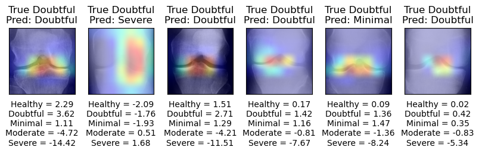
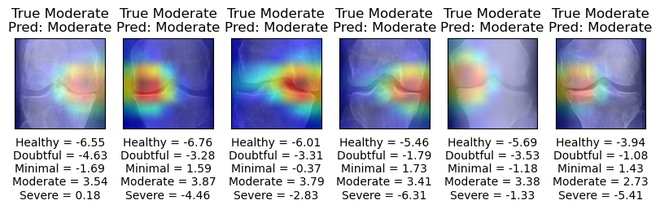
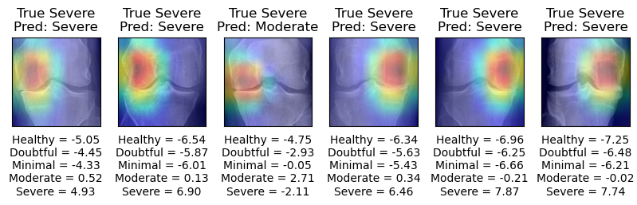

# Knee Osteoarthritis Detection using Deep Learning

This project implements an AI-powered system for detecting and grading knee osteoarthritis severity from X-ray images using deep learning techniques.

## Overview

The system uses state-of-the-art deep learning models (Xception, ResNet50, and Inception-ResNet-V2) to classify knee X-rays into five severity grades:
- Healthy
- Doubtful
- Minimal 
- Moderate  
- Severe

The project includes a user-friendly web interface built with Streamlit that allows medical professionals to:
- Upload knee X-ray images
- Get instant severity predictions
- View model explainability through Grad-CAM visualization
- See confidence scores for each severity grade

## Screenshots


### Data Distribution


### Model Performance


### Sample Classifications
| Severity Grade | Sample X-ray |
|---------------|-------------|
| Healthy |  |
| Doubtful |  |
| Minimal |  |
| Moderate |  |
| Severe |  |

## Dataset and Models

**Note**: 
1. The dataset is not included in this repository due to size constraints. You will need to obtain the dataset separately and place it in the `dataset/` directory with the following structure:
2. Trained model files (*.hdf5) are also not included due to GitHub file size limitations. You can train the models using the provided notebooks or contact the maintainers for access to pre-trained models.
```
dataset/
├── train/              # Training data
├── val/                # Validation data
└── test/               # Test data
```

## Project Structure

```
.
├── app/                      # Streamlit web application
│   ├── app.py               # Main application code
│   └── img/                 # Application images
├── assets/                  # Project screenshots and images
├── dataset/                 # Training and testing datasets
│   ├── train/              # Training data
│   ├── val/                # Validation data
│   └── test/               # Test data
├── src/                    # Source code
│   ├── models/             # Saved model files
│   ├── 01_data_preparation.ipynb
│   ├── 02_ensemble_models.ipynb
│   ├── 02_model_inception_resnet_v2.ipynb
│   ├── 02_model_resnet50.ipynb
│   ├── 02_model_xception.ipynb
│   └── 03_best_model_on_test_xception.ipynb
└── environment.yml         # Conda environment specification
```

## Setup

1. Create conda environment:
```bash
conda env create -f environment.yml
```

2. Activate environment:
```bash
conda activate knee_dl_app
```

3. Run the application:
```bash
streamlit run app/app.py
```

## Technologies Used

- **Deep Learning Models**: 
  - Xception
  - ResNet50
  - Inception-ResNet-V2
- **Libraries**:
  - TensorFlow 2.10.0
  - Streamlit
  - NumPy
  - Pandas
  - Matplotlib
  - Scikit-learn

## Model Training

The project uses transfer learning with three state-of-the-art CNN architectures:

1. **Data Preparation** (`01_data_preparation.ipynb`):
   - Image preprocessing
   - Dataset splitting
   - Augmentation strategies

2. **Model Training** (Individual model notebooks):
   - Fine-tuning pretrained models
   - Hyperparameter optimization
   - Model evaluation

3. **Ensemble Learning** (`02_ensemble_models.ipynb`):
   - Combining predictions from multiple models
   - Performance evaluation
   - Model selection

4. **Final Testing** (`03_best_model_on_test_xception.ipynb`):
   - Evaluation on held-out test set
   - Performance metrics
   - Model interpretability analysis
